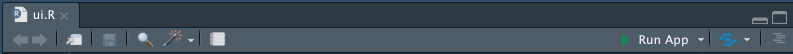

## [Shiny](https://shiny.rstudio.com/tutorial/)

Shiny is a way to to build interactive web applications for data visualization.
It is a package implemented in `R`, but connected to many html
"widgets" and JavaScript libraries to produce web content.

Shiny is both a tool for writing web applications, and a server for running them. Apps can be run directly from R, or hosted on a shiny server (for instance, [shinyapps.io](http://www.shinyapps.io/)).

Shiny websites can be:  

* used to interact with your own data
* used to visualize multi-dimensional data one chunk at a time
* can replace page after page of static plots with a single interactive tool

They can include interactive elements like dropdown lists,
radio buttons, checkboxes, and so on. These can call code
in R to produce a plot, and wrap it in the html and JavaScript
necessary to render the website. 

An example:
[Route trends](https://metrotransitmn.shinyapps.io/route-trends/)

## Coding a shiny app

A shiny app has two fundamental components:

### **ui**
The *U*ser *I*nterface component, describing the layout of the web
page the app will display, including:

* the layout, including panels, columns, and rows
* the interactive elements, including text, select, checkbox, and range inputs
* how outputs from R--data, text and plots--should be rendered

### **server**
The "back-end" component, the server implements the functionality of the app, handling inputs from the UI, and creating outputs for the UI.

The general form of server activity is to take `input` values from choices made in
the UI, perform specified functions in R, and return the desired `output` to the UI
for rednering. 

## A shiny example walk-through

### Objective: visualize transit on-board survey
Imagine you just received the cleaned responses from 1000 riders on board the transit
system of Busytown. Riders were intercepted randomly, and asked a battery of 
questions about their trip purpose, origin, destination, etc. We want to be able to 
visualize the responses interactively, to facilitate initial data exploration. Further, we want to be able to visualize the responses either by looking at the totals, 
or by looking at how the responses change with time of day. 

We could simply create a bunch of static plots to export as pdfs, or a single Rmarkdown
html document. But better would be, an _interactive_ plot which let the investigator choose 
which variable to look at in a given moment. 
 
### Synthesized Busytown survey data  
Let's start by creating some survey data. One of the best things about `R` is the ability to
synthesize data according to a predicted form but with some randomness for realism. 

```
library(data.table) ## fast for big data
library(ggplot2)  ## powerful visualizations

## create sample of travel behavior survey data that mimics transit travel purpose ####
# grids of survey responses are weighted to be sort of realistic, but need not be

purpose_grid <- data.table(purpose = c('home', 'work', 'school', 'shopping', 'airport', 'social/recreational'),
                         weights = c(0.5, 0.27, 0.12, .05, .01, .05))

hr_grid <- data.table(hr = as.ITime(4:22*60*60), # ITime is in seconds past midnight, here 4am to 10pm
                      weights = c(0.01, 0.01, 0.01, 0.05, 0.07, 0.07, 0.05, 0.05, 0.07,
                                      0.05, 0.05, 0.07, 0.15, 0.13, 0.07, 0.05, 0.02, 0.01, 0.01))

mode_grid <- data.table(transit_mode = c('local bus', 'express bus', 'light rail'),
                        weights = c(0.67, 0.1, 0.23))

## random draws are taken of each variable independently, and comined into one dataset ####
# example 
sample(purpose_grid$purpose, 10, replace = T, prob = purpose_grid$weights)

# use set.seed function if you wish to have the exact same results as example dataset

# set.seed(22)
survey_sim <- data.table(trip_purpose = factor(sample(purpose_grid$purpose, 1000, 
                                                      replace = T, prob = purpose_grid$weights),
                                               levels = c('home', 'work', 'school', 'shopping',
                                                            'airport', 'social/recreational'), ordered = T),
                        hr_surveyed = sample(hr_grid$hr, 1000, replace = T, prob = hr_grid$weights),
                        mode_surveyed = factor(sample(mode_grid$transit_mode, 1000, replace = T, prob =mode_grid$weights),
                                                levels = c('local bus', 'express bus', 'light rail'), ordered = T))
                                                
```

Let's start with a static version of the plot we wish to see in the world. We use the `ggplot2` package for its ease of creating pretty good figures right away:

```
p <- ggplot(survey_sim, aes(x = trip_purpose))
p + geom_bar()
```

This is the plot we want to make more interactive. Instead of
specifying each `aes(x = )` argument over all of the possible
columns, we want to build an app that will let us pick the 
column we are interested in, but otherwise build the rest of the plot
exactly the same way.

One thing we will need is a list of columns to choose from. 
In our example dataset there are only two that are responses, but thinking
ahead to the full Busytown dataset, we want to make this generic. 
One simple thing is to just take the columns that are defined
as factors, and put those column names in a vector:

```
xvars <- names(survey_sim)[sapply(survey_sim, is.factor)]
```

This is an example of something that might go into a helper script that can be called
by the `server.R`. These helper files conventionally are named `global.R`.

### server
We know that the server will construct and render the plot. It
is a function, which takes in `input` values and returns `output`. 

In our case, `input` = which variable we want;
`output` = the barplot with the correct variable.

```
server = function(input, output) {
  output$main_plot <- renderPlot({
      ggplot(dat, aes_string(x = input$varchoice)) + 
      geom_density()
   })
}
```
Things to note:

* the plot to be displayed is rendered and assigned to the
	output object with the name `main_plot`
* the ggplot code refers to an input object in the `aes_string` argument. 
this version of the `aes` function takes a character value 
and uses it to find the corresponding column in the specified dataset. 
That means we can pass column names back and forth between ui and server as
strings, rather than subsetting data and passing that back and forth.

`renderPlot()` is a *reactive* function, which means it will 
adjust and re-create itself based on the value of the input.


### ui
The user interface is where the selection of the inputs is 
made, and where the output is displayed. In this case we want to display
the rendered plot we assigned to `output$main_plot`. Since this plot relies on
an input value `input$varchoice`, we have to define that too.

We start with how the overall page will look.

```
ui = shinyUI(
    fluidPage(h4(strong("data exploration plots")),
              p("Plotting counts of observed variables"),
              fluidRow( ...
```

Here we see things that look a little non-R-like. There
are functions in R which translate to html syntax: `strong()`
is like "boldface", `p()` means a paragraph of text. 

The `fluidPage` and `fluidRow` are shortcuts to creating nicely
laid out blocks in the html, which will work in almost any browser
and on any computer or mobile device.

It takes some getting used to, but when working in the ui, try 
to think as if you were building a static page with sections, 
rather than thinking too much about the interactivity.

```
ui = shinyUI(
    fluidPage(h4(strong("data exploration plots")),
              p("Plotting density of observed variables, all obs or by trt"),
              fluidRow(
                column(3, 
                       selectizeInput(inputId = "varchoice", 
                                      label = "Choose variable:", 
                                      choices = xvars,
                                      selected = xvars[1])),
   
```
Here we have added our dropdown box. `selectizeInput` creates
the selector. 

* The *inputId* is the name we use to access the variable in the server section. 
* The *label* is just that, what 
will appear on the screen above or next to the dropdown. 
* The *choices* for the dropdown are what we defined earlier, and the
default selection (*selected*) will simply be the first column in the `xvars`
vector.

***

So the input has been constructed, what about the output? In
this case we just have to create a space on the page in which 
we want the rendered plot to be displayed - same row, a wider column - 
and then refer back to the `outputId` we gave it in our server
definition:

```
ui = shinyUI(
    fluidPage(h4(strong("data exploration plots")),
              p("Plotting density of observed variables, all obs or by trt"),
              fluidRow(
                column(3, 
                       selectizeInput(inputId = "varchoice", 
                                      label = "Choose variable:", 
                                      choices = xvars,
                                      selected = xvars[1])),
                column(8,
                       plotOutput(outputId = 'main_plot')
                )# end column
              ) # end FluidRow, 
    ) # end page
    
  ) # end UI
```
### Shiny App function
To put it all together, we wrap both the server and ui definitions
into a `shinyApp()` function:

```
shinyApp(
  server = function(input, output) {
    output$main_plot <- renderPlot({
        ggplot(survey_sim, aes_string(x = input$varchoice)) + geom_bar()
    })
  },
  
  ui = shinyUI(
    fluidPage(h4(strong("data exploration plots")),
              p("Plotting counts of observed variables"),
              fluidRow(
                column(3, 
                       selectizeInput(inputId = "varchoice", 
                                      label = "Choose variable:", 
                                      choices = xvars,
                                      selected = xvars[1])),
                column(8,
                       plotOutput(outputId = 'main_plot')
                )# end column
              ) # end FluidRow, 
    ) # end page
    
  ) # end UI
) # end App
```

### Run the App  
Once the app is defined using the `shinyApp` function, it can be called by running:  
```
shiny::runApp()
```

When the script defining the shiny app is open in an RStudio project, you can also
run the app by clicking the "Run App" button on the top of the source editor:


## Modify app to optionally plot by time of day
To add a checkbox for plotting by time of day, we can start
by adding another input section, this time beginning with the 
ui side (so we know where it will be shown on the page):
```
...
column(3, 
                     selectizeInput(inputId = "varchoice", 
                                    label = "Choose variable:", 
                                    choices = xvars,
                                    selected = xvars[1]),
                   checkboxInput(inputId = 'plotbytime',
                                  label = strong('Plot by time of day'),
                                  value = FALSE)),                               
...
```
With `input$plotbytime` defined, we need to define how to use it on the server
side. Because it is a logical (checkboxes are either TRUE or FALSE)
a straightforward `if() else ` will do:

```
 ...
    if(input$plotbytime) {
      ggplot(survey_sim, aes(x = factor(hr_surveyed))) + geom_bar(aes_string(fill = input$varchoice)) + 
        theme(axis.text.x = element_text(angle = 45, hjust = 1))
    } else {
      ggplot(survey_sim, aes_string(x = input$varchoice)) + geom_bar()
    }
 ...
```
The other trick added here is the `theme` function to rotate the x axis text. I have to search stackoverflow for this syntax every single time I try to remember it.

Anyway, wrapping those two pieces together with what we had before:

```
shinyApp(
server = function(input, output) {
  output$main_plot <- renderPlot({
    if(input$plotbytime) {
      ggplot(survey_sim, aes(x = factor(hr_surveyed))) + geom_bar(aes_string(fill = input$varchoice)) + 
        theme(axis.text.x = element_text(angle = 45, hjust = 1))
    } else {
      ggplot(survey_sim, aes_string(x = input$varchoice)) + geom_bar()
    }
   })
},

ui = shinyUI(
  fluidPage(h4(strong("data exploration plots")),
            p("Plotting density of observed variables, all obs or by time"),
            fluidRow(
              column(3, 
                     selectizeInput(inputId = "varchoice", 
                                    label = "Choose variable:", 
                                    choices = xvars,
                                    selected = xvars[1]),
                    checkboxInput(inputId = 'plotbytime',
                                  label = strong('Plot by time of day'),
                                  value = FALSE)),
              column(8,
                     plotOutput(outputId = 'main_plot')
                     )# end column
              ) # end FluidRow, 
  ) # end page
  
) # end UI
) # end App

shiny::runApp() # run the app in R
```

## Coding challenge  
Using the syntax suggested by the [Shiny tutorials](https://shiny.rstudio.com/gallery/sliders.html),
add a slider bar to the second app, which would allow the user to restrict the data to include only a certain 
range of times of day. 
